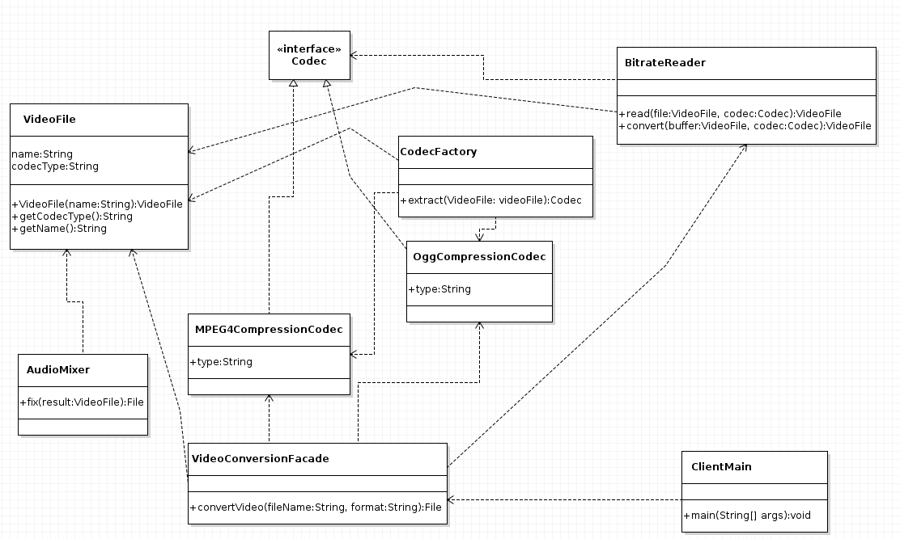
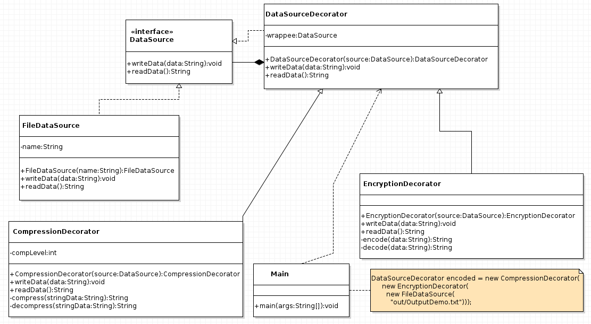
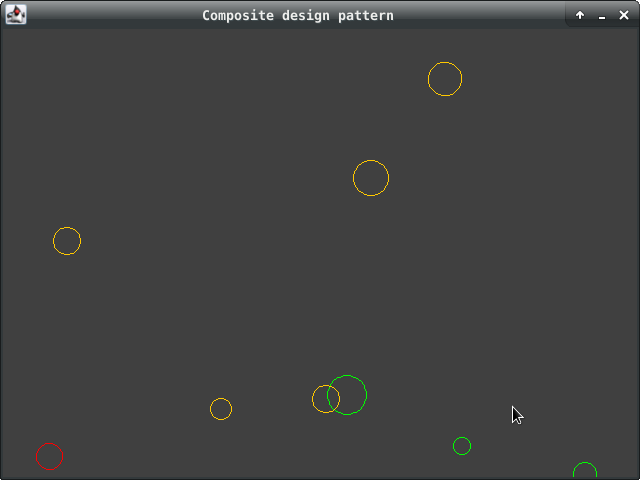
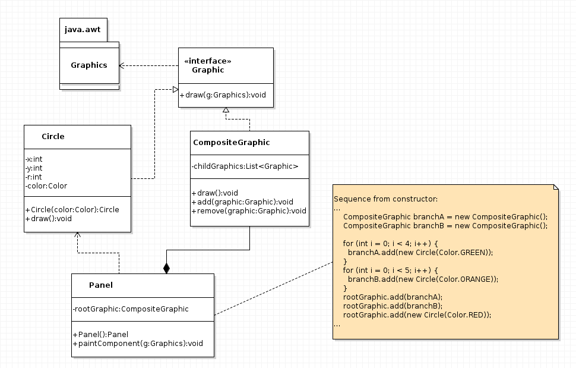
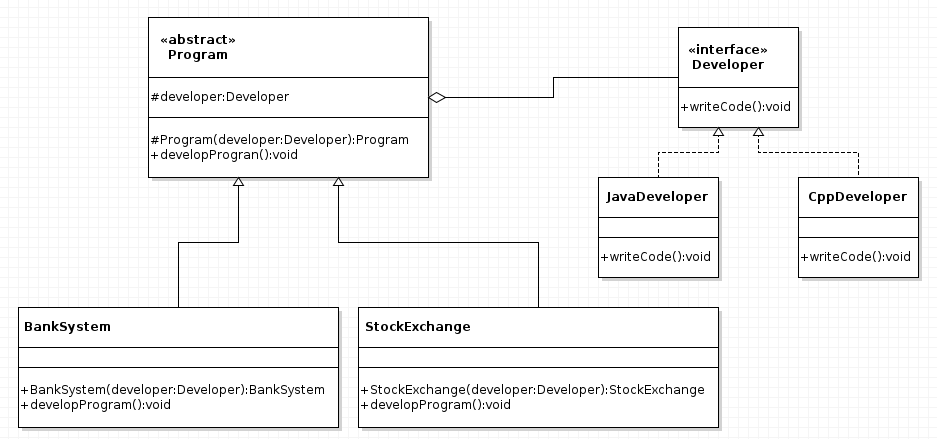
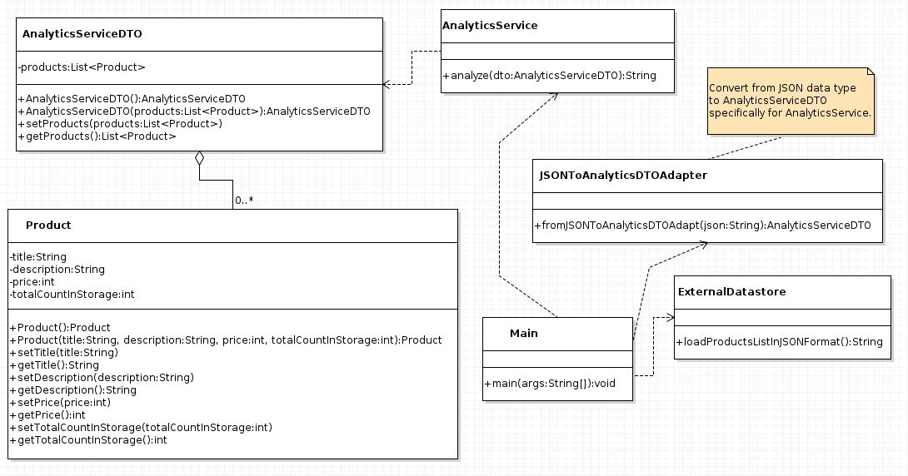
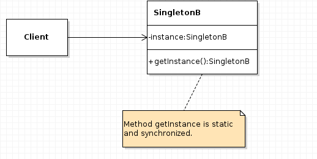
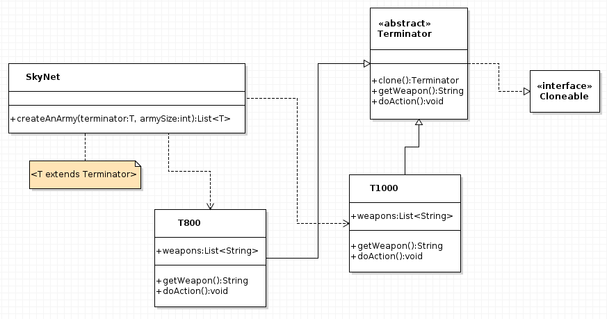
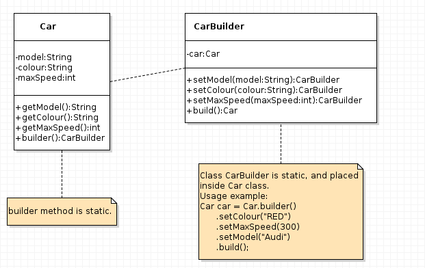

# Java fundamentals

## 1) Dessign patterns

#### Structural ( Facade ) :

Facade - позволяет скрыть сложность системы путём сведения всех возможных внешних вызовов к одному объекту, делегирующему их соответствующим объектам системы.

  

#### Structural ( Decorator ) :

Decorator - предназначенный для динамического подключения дополнительного поведения к объекту. Шаблон Декоратор предоставляет гибкую альтернативу практике создания подклассов с целью расширения функциональности.

  

#### Structural ( Composite ) :

Composite - объединяет объекты в древовидную структуру для представления иерархии от частного к целому. Компоновщик позволяет клиентам обращаться к отдельным объектам и к группам объектов одинаково.

  
  

#### Structural ( Bridge ) :

Bridge - разделяет абстракцию и реализацию так, чтобы они могли изменяться независимо. Шаблон мост использует инкапсуляцию, агрегирование и может использовать наследование для того, чтобы разделить ответственность между классами.

  

#### Structural ( Adapter ) :

Adapter - структурный паттерн проектирования, который позволяет объектам с несовместимыми интерфейсами работать вместе.

  

#### Creational ( Singleton ) :

Singleton - гарантирует, что в приложении будет единственный экземпляр некоторого класса, и предоставляющий глобальную точку доступа к этому экземпляру.

  

#### Creational ( Prototype ) :

Prototype - Задаёт виды создаваемых объектов с помощью экземпляра-прототипа и создаёт новые объекты путём копирования этого прототипа. 

  

#### Creational ( Builder ) :

Builder - отделяет конструирование сложного объекта от его представления так, что в результате одного и того же процесса конструирования могут получаться разные представления.

  

#### Creational ( Abstract factory ) :

Abstract factory - предоставляет интерфейс для создания семейств взаимосвязанных или взаимозависимых объектов, не специфицируя их конкретных классов.

  

  

#### Creational ( Factory method ) :

Factory method - предоставяет подклассам (дочерним классам) интерфейс для создания экземпляров некоторого класса. В момент создания наследники могут определить, какой класс создавать.

  

  

