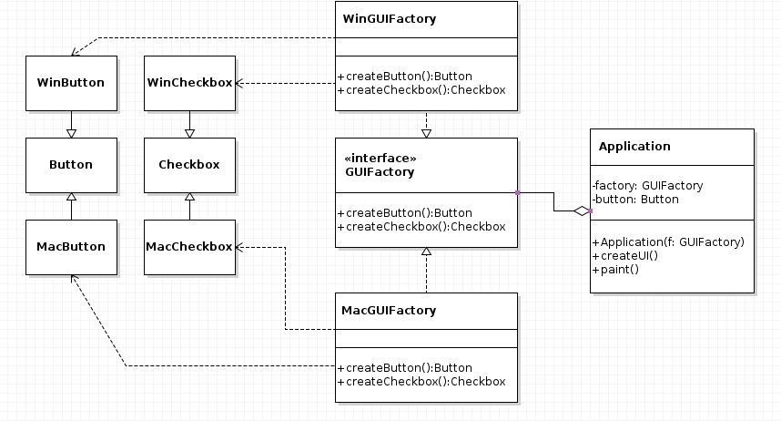
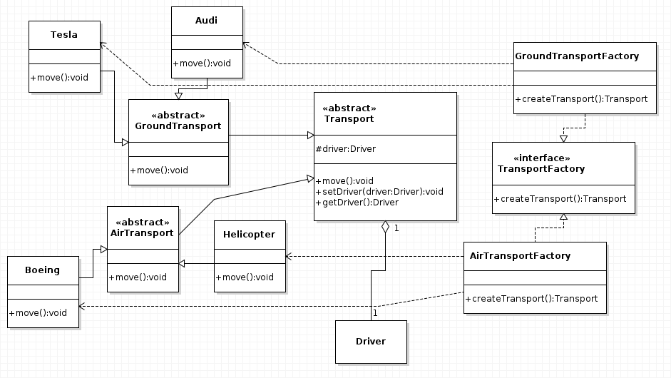
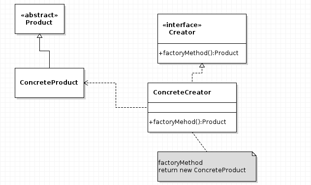
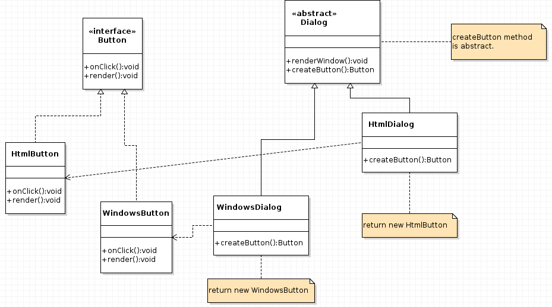

# Learn java

## 1) Dessign patterns

#### Creational ( Abstract factory ) :

Abstract factory - предоставляет интерфейс для создания семейств взаимосвязанных или взаимозависимых объектов, не специфицируя их конкретных классов.

  

  

#### Creational ( Factory method ) :

Factory method - предоставяет подклассам (дочерним классам) интерфейс для создания экземпляров некоторого класса. В момент создания наследники могут определить, какой класс создавать.

  

  

